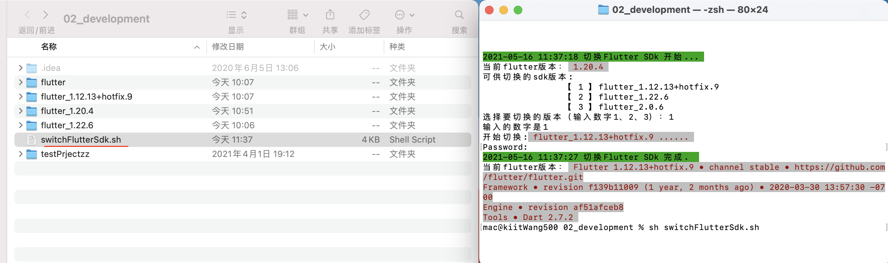
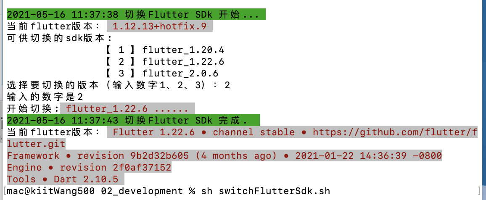
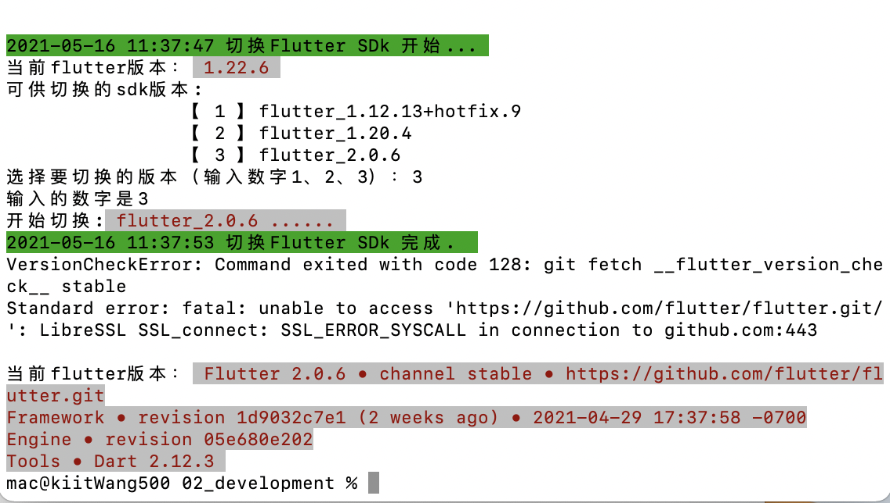

# switchFlutterSdk
you can use the shell to switch flutter SDK so easy.

只需要把这个switchFlutterSdk.sh放到你电脑中Flutter的目录（多个flutter 版本），
运行脚本 sh swithFlutterSdk.sh ，按照提示选择你要切换的版本即可。

## Screenshots

<table>

<tr>
<td>

</td>
</tr>

<tr>
<td>

</td>
<td>

</td>
</tr>

</table>